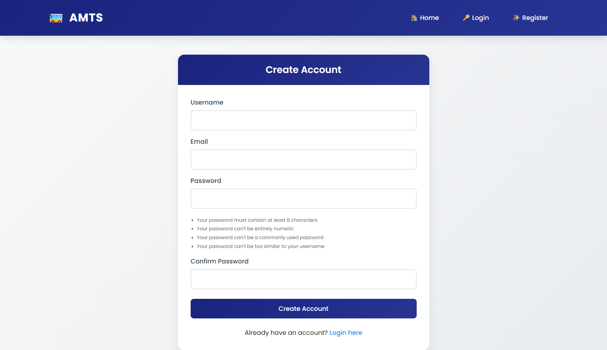
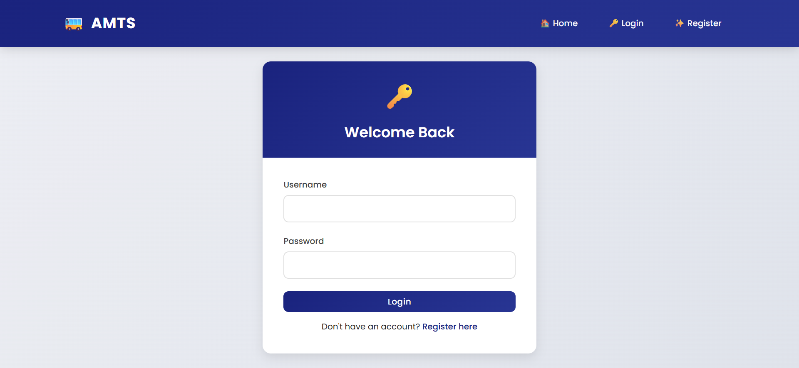
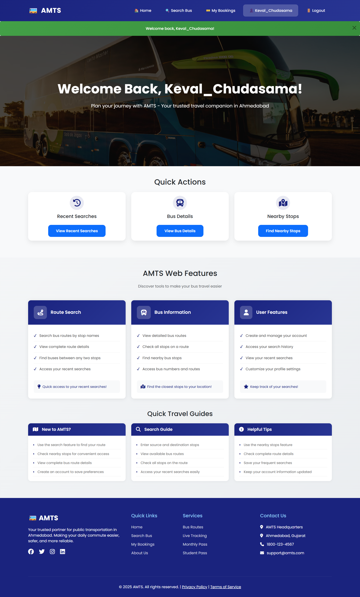
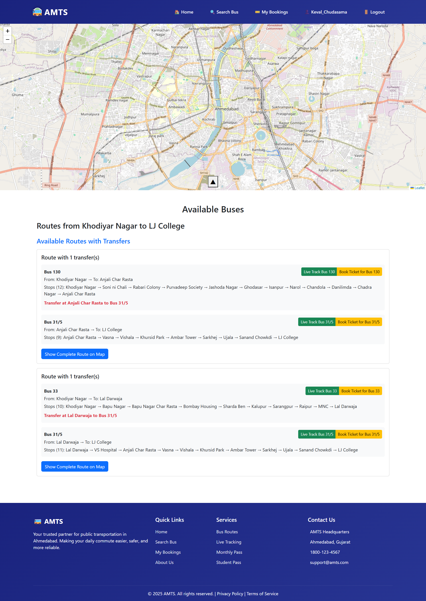
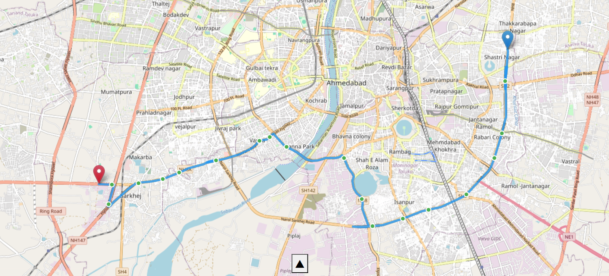
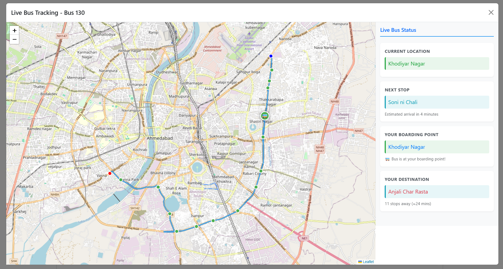
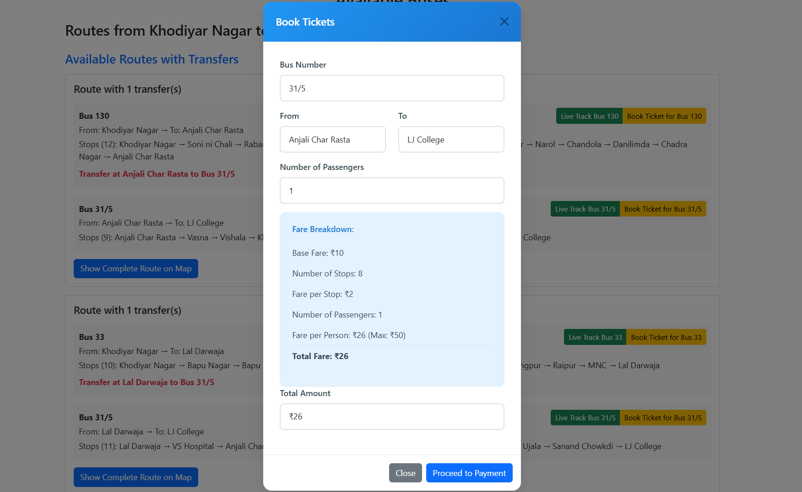
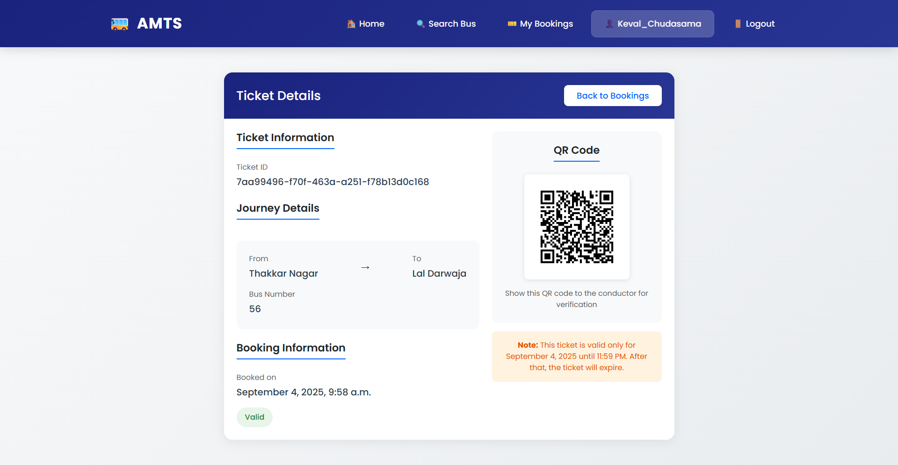

# AMTS (Advanced Multi-modal Transport System)

A Django-based web application for managing and booking multi-modal transportation services.

## Working Video Of this Project

[▶ Watch Video on Google Drive](https://drive.google.com/file/d/1pPtq6urLZ6ODjrldpWrYf3Ji1YfBPkE4/view?usp=drive_link)

## Features

### User Authentication and Authorization

## Register Page



## Login Page



#### User Types
1. **Regular Users**
   - Can register for a new account
   - Login/Logout functionality
   - View and manage their bookings
   - Access booking history
   - Save and view search history

2. **Staff/Admin Users**
   - Separate authentication flow for admin access
   - Access to admin dashboard
   - Manage buses, routes, and user bookings
   - View system analytics

#### Security Features
- Secure password hashing and validation
- Session-based authentication
- CSRF protection
- Separate authentication backends for admin and regular users
- Password reset functionality (if implemented)
- Account lockout after multiple failed login attempts

#### Authentication Flow
1. **Registration**
   - Users can register with username, email, and password
   - Form validation for strong passwords
   - Email verification (if implemented)

2. **Login**
   - Username/Password authentication
   - Session management with configurable timeout
   - Redirects to appropriate dashboard based on user type

3. **Access Control**
   - Role-based access control (RBAC)
   - Protected routes for authenticated users only
   - Admin-specific routes for staff users


```markdown
## Route Planning and Ticket Booking

### Route Planning Features
- **Intelligent Route Search**
  - Find optimal routes between any two locations
  - View both direct and transfer routes
  - Real-time bus availability and scheduling
  - Search history for frequent routes

- **Comprehensive Route Details**
  - Complete stop-by-stop information
  - Estimated travel time and distance
  - Bus numbers and vehicle types
  - Interactive map view of routes

### Ticket Booking System
- **Easy Booking Process**
  - Select travel date and time
  - Choose number of passengers
  - Seat selection (if applicable)
  - Booking review and confirmation

- **Booking Management**
  - View all past and upcoming bookings
  - Download e-tickets with QR codes
  - Cancel bookings (subject to policy)
  - Real-time booking status updates

- **Secure Payments**
  - Multiple payment methods
  - Encrypted transaction processing
  - Instant booking confirmation
  - Email/SMS notifications

### User Experience
- Save favorite routes for quick access
- View recent searches
- Track bus locations in real-time
- Get alerts for delays or changes
```
## DashBoard



## Search Buses



## Route On Map



## Tracking The Moving Bus On Map



## Ticket Booking For Perticular Bus




```markdown
## QR Code Generation for Tickets

### Overview
The system generates unique QR codes for each ticket, providing a secure and efficient way to validate tickets. Each QR code contains essential ticket information that can be quickly scanned and verified by conductors.

### Key Features

#### 1. QR Code Contents
- **Ticket ID**: Unique identifier for each ticket
- **Bus Number**: Identification of the bus
- **Route Information**: 
  - Boarding point (From)
  - Destination (To)
- **Booking Reference**: Link to the booking details

#### 2. Technical Implementation
- **Library Used**: `qrcode` (Python library)
- **Storage**: QR codes are stored as PNG images in the media directory
- **File Naming**: Each QR code is named with the pattern `qr_code_{ticket_id}.png`

#### 3. Generation Process
1. **Automatic Generation**:
   - QR code is automatically created when a new ticket is saved
   - Implemented in the `save()` method of the Ticket model

2. **Data Encoding**:
   - Uses QR Code version 1 with error correction
   - Encodes ticket information in a human-readable format
   - Includes essential details for verification

3. **Storage**:
   - QR codes are saved in the `media/qr_codes/` directory
   - Database stores the relative path to the QR code image

#### 4. Usage
- **Display**: Shown on the ticket details page
- **Verification**: Can be scanned by conductors using any standard QR code scanner
- **Mobile-Friendly**: Optimized display on both desktop and mobile devices

#### 5. Security
- Each QR code contains a unique ticket ID
- Encoded data is tamper-evident
- Access to QR codes is protected by authentication

### Visual Representation
The QR code is prominently displayed on the ticket with:
- Clear "QR Code" heading
- White background for better scanning
- Help text for users explaining its purpose
- Responsive sizing for different screen sizes

### Error Handling
- Graceful fallback if QR code generation fails
- Validation to prevent duplicate QR code generation
- Error messages for failed QR code displays
```

## Ticket Information



- Responsive design for mobile and desktop

## Prerequisites

- Python 3.8+
- Django 4.0+
- SQLite (default) or PostgreSQL
- Node.js and npm (for frontend assets if any)

## Installation

1. Clone the repository:
   ```bash
   git clone <repository-url>
   cd grp_p
   ```

2. Create and activate a virtual environment:
   ```bash
   python -m venv venv
   .\venv\Scripts\activate  # On Windows
   ```

3. Install dependencies:
   ```bash
   pip install -r requirements.txt
   ```

4. Apply migrations:
   ```bash
   python manage.py migrate
   ```

5. Create a superuser (optional):
   ```bash
   python manage.py createsuperuser
   ```

6. Run the development server:
   ```bash
   python manage.py runserver
   ```

## Project Structure

```
myAmts/
├── myAMTS/               # Main project directory
│   ├── media/            # User-uploaded files
│   ├── myAMTS/           # Project settings
│   ├── my_amts/          # Main app
│   ├── staticfiles/      # Static files
│   ├── manage.py         # Django management script
│   └── db.sqlite3        # Database file
```

## Contributing

1. Fork the repository
2. Create your feature branch (`git checkout -b feature/AmazingFeature`)
3. Commit your changes (`git commit -m 'Add some AmazingFeature'`)
4. Push to the branch (`git push origin feature/AmazingFeature`)
5. Open a Pull Request


